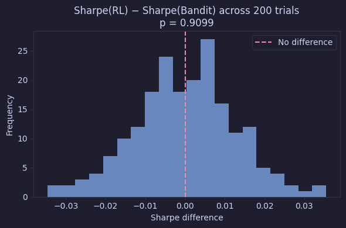

<p align="center">
  
</p>

<h1 align="center">Stop Teaching Your Portfolio to Walk</h1>
<h3 align="center">Why Reinforcement Learning Might Be Overkill for Most Traders</h3>

---

## Overview

A quantitative investigation into whether reinforcement learning (Q-Learning) provides any structural advantage over a simple bandit strategy for price-taking investors. The core argument: when a trader's actions have zero market impact, the Bellman equation's future-reward term becomes irrelevant to action selection, and **RL collapses into immediate reward maximisation - exactly what a bandit does**.

This is validated empirically via **200 Monte Carlo trials** and a one-sample t-test, yielding a $p$-value of **0.91** - no significant difference between the two strategies.

---

## The Argument

A **momentum bandit** picks the action that maximises immediate expected reward:

$$a_t^* = \arg\max_a \; \mathbb{E}[R_t \mid A_t = a]$$

**Q-Learning** learns an action-value function via the Bellman optimality equation:

$$Q(s, a) = \mathbb{E}\Big[R_{t+1} + \gamma \max_{a'} Q(S_{t+1}, a') \;\Big|\; S_t = s,\; A_t = a\Big]$$

Updated online with the TD(0) rule:

$$Q(s, a) \leftarrow Q(s, a) + \alpha \Big[r_{t+1} + \gamma \max_{a'} Q(s', a') - Q(s, a)\Big]$$

In a price-taker world the state transition $P(s' \mid s, a)$ is independent of $a$. The future-reward term becomes a constant with respect to the current action choice:

$$\arg\max_a \; Q(s, a) = \arg\max_a \; \mathbb{E}[R_{t+1} \mid s, a] + \gamma \underbrace{\mathbb{E}\Big[\max_{a'} Q(S_{t+1}, a')\Big]}_{\text{constant w.r.t. } a} = \arg\max_a \; \mathbb{E}[R_{t+1} \mid s, a]$$

The discount factor $\gamma$ becomes irrelevant. **RL degenerates into a bandit.**

---

## Experiment

Prices are simulated via Geometric Brownian Motion $$(\text{log-returns} \sim \mathcal{N}(\mu - \frac{\sigma^2}{2}, \sigma^2))$$ with $T = 10{,}000$ steps, $\mu = 0$, $\sigma = 0.01$, and $S_0 = 100$. Both strategies trade the same price paths and are compared on **Sharpe ratio**.

### Monte Carlo Hypothesis Test (200 Trials)

$$H_0: \mu_\Delta = 0 \quad \text{where} \quad \Delta_i = \text{Sharpe}_{\text{RL}}^{(i)} - \text{Sharpe}_{\text{Bandit}}^{(i)}$$

$$H_1: \mu_\Delta \neq 0$$

<p align="left">
  
</p>

| Metric | Value |
|:------:|:-----:|
| Mean $\Delta$ | 0.0001 |
| $t$-statistic | 0.113 |
| $p$-value | **0.9099** |

The $p$-value is far above any conventional significance level. We **fail to reject $H_0$** - there is no statistically significant advantage for Q-Learning over the bandit.

---

## Project Structure

```
├── README.md
├── requirements.txt
├── src/
│   ├── agents.py          # Bandit strategy & Q-Learning agent
│   ├── environment.py     # GBM price simulation
│   ├── experiments.py     # Monte Carlo trials & t-test
│   └── metrics.py         # Sharpe ratio, cumulative PnL, max drawdown
└── notebooks/
    └── investigation.ipynb   # Full walkthrough with plots

```

---

## Setup

```bash
pip install -r requirements.txt
jupyter notebook notebooks/investigation.ipynb
```
---

## Limitations

- No transaction costs, slippage, or execution frictions.
- Tabular Q-learning with only 3 discrete states and fixed hyperparameters ($\alpha = 0.1$, $\gamma = 0.95$, $\varepsilon = 0.1$).
- GBM dynamics: real markets exhibit fat tails, volatility clustering, and regime changes.
- RL may still be valuable for dynamic risk allocation, execution scheduling, or regime switching, even if it does not improve directional trading for price-takers.
